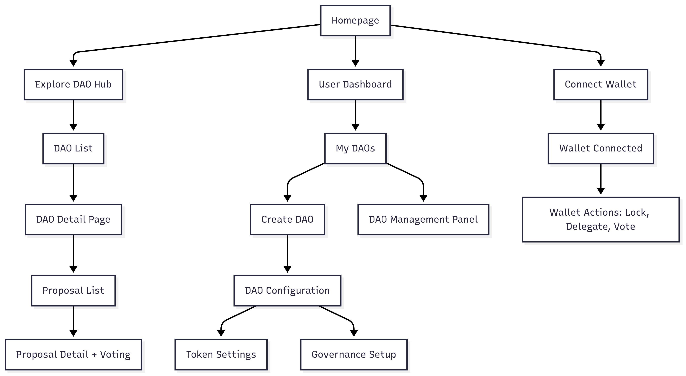
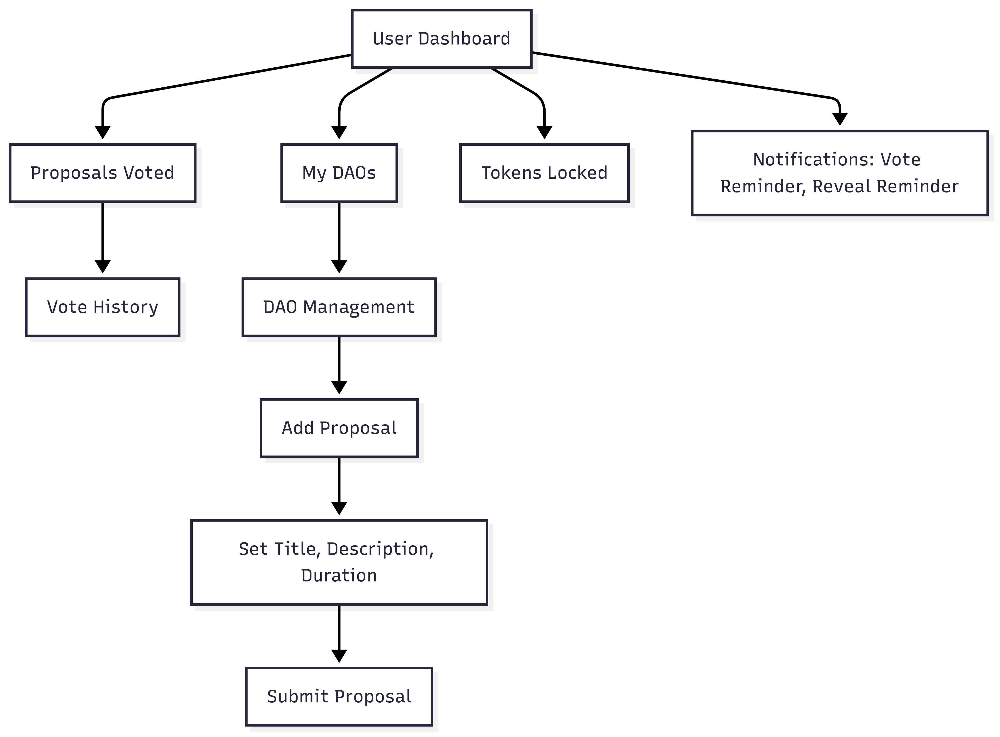
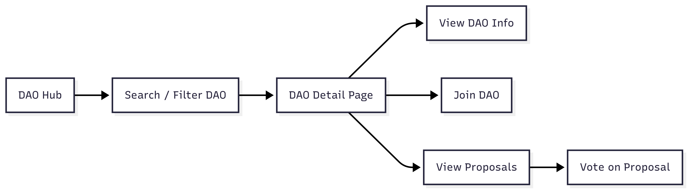
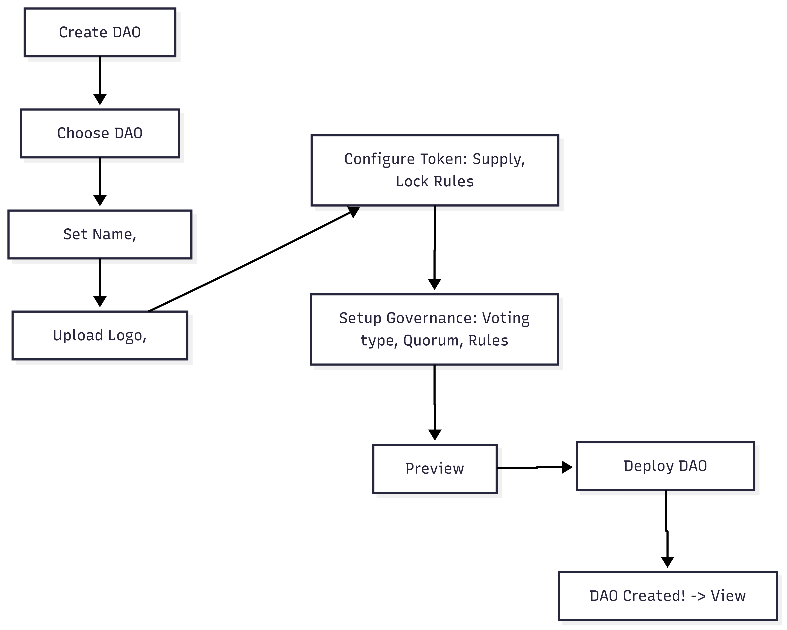

# Mapping

### General&#x20;

<figure><figcaption></figcaption></figure>

### User Dashboard&#x20;

<figure><figcaption></figcaption></figure>

### Explorer DAO&#x20;

<figure><figcaption></figcaption></figure>

### Create new DAO&#x20;

<figure><figcaption></figcaption></figure>

