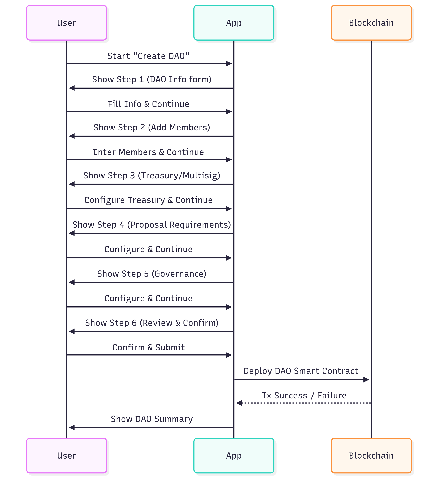
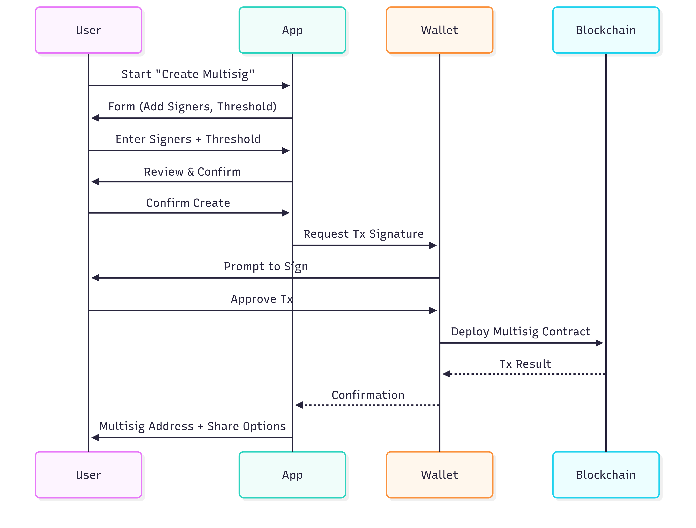
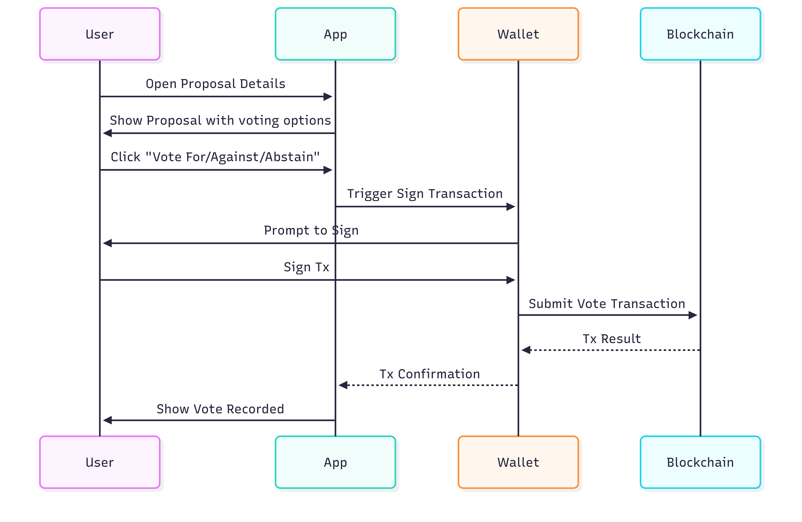

# Mapping

###

We are building and the design would be changed. Explorer our product and give feedback [https://dao4e.netlify.app/](https://dao4e.netlify.app/)

### General&#x20;

<figure><figcaption></figcaption></figure>

### User Dashboard&#x20;

<figure><figcaption></figcaption></figure>

<figure><figcaption>
Dashboard sidebar menu
</figcaption></figure>

### Explorer DAO&#x20;

<figure><figcaption></figcaption></figure>

### Create new DAO&#x20;

<figure><figcaption></figcaption></figure>

<figure><figcaption></figcaption></figure>

### Multisig creation

<figure><figcaption></figcaption></figure>

### Voting flow

<figure><figcaption></figcaption></figure>
